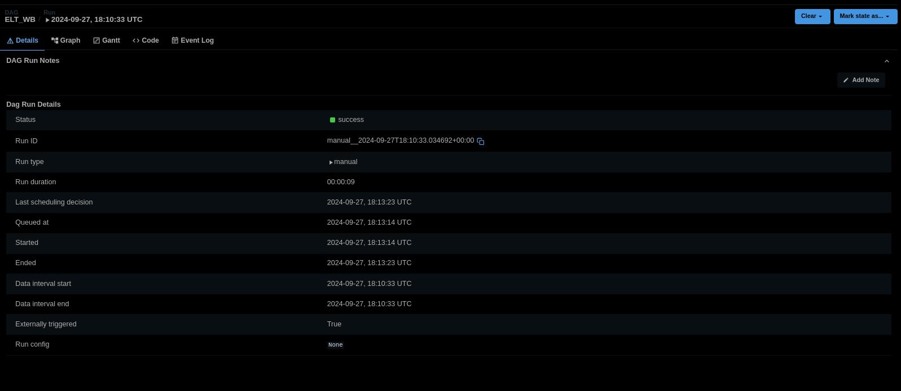
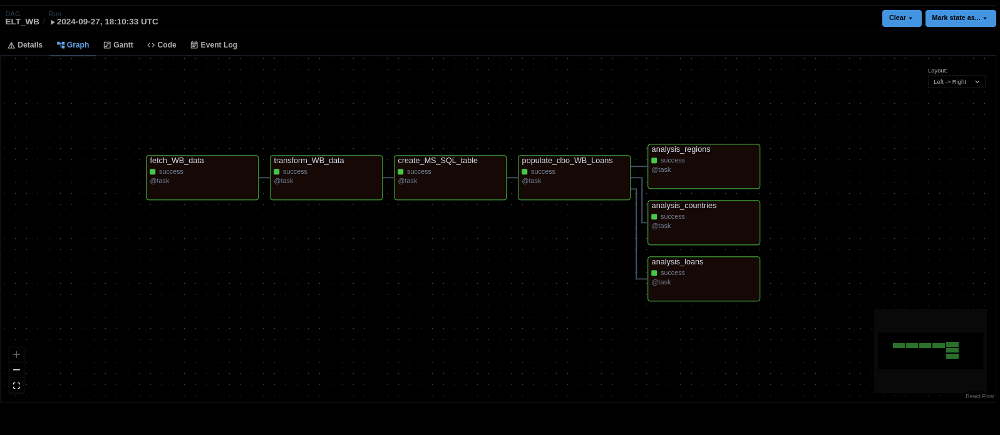

## Proof of Successful Pipeline Execution

### Airflow DAG and Task Success
Below are screenshot details of the Airflow UI showing a successful DAG run for this pipeline:
 
 

##### -**DAG GENERAL VIEW:**
  
 1 -  General Details
   
 
 2 - Graph Run VIew  
 

- **Tasks Logs**

Below are log details for each of the Airflow successful tasks run for this pipeline:

- TASK 1: Fetch Data 
  

- TASK 2: Transform Data
  

- TASK 3: Create Table in Azure SQL Database 
  

- TASK 4: Populate newly created table
  

- TASK 5: Analyze regions with the highest loan debts
  

- TASK 6: Analyze countries with highest loan debts per region
  

- TASK 7: Analyze countries with highest number of active loans

